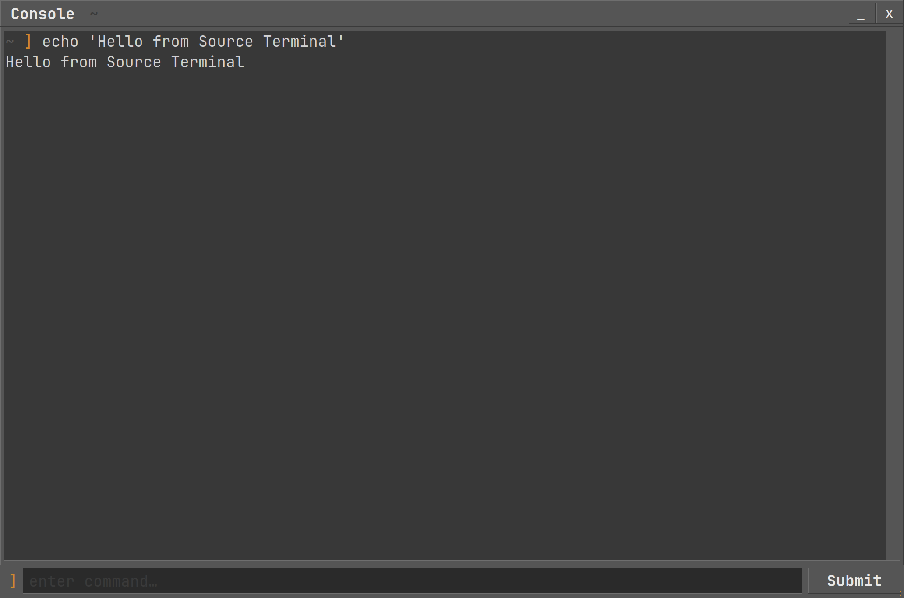

# Source Console (`srcterm`)

A terminal emulator skinned to look like the **Source Engine developer
console**. Built suckless-style — **raw Xlib + Xft** for the window/text and
**libvterm** for the terminal emulation. No GTK, no VTE.

```
window / input / render : Xlib + Xft (FreeType)
terminal engine         : libvterm   (feed pty bytes -> screen grid)
shell                   : zsh via forkpty() (full interactive)
```

A real, modern terminal (on par with Alacritty) wearing Source/VGUI chrome.



- Classic VGUI look: beveled "Console" window, Submit button, scrollbar — all
  hand-drawn. Drag the title bar to move, any edge/corner to resize, `_`/`x` to
  minimise/close.
- **Two input modes** (toggle with **Ctrl+`**, or click):
  - **Passthrough / direct** (default): every keystroke goes to the running
    program, encoded via libvterm's keyboard layer (application cursor-key /
    keypad modes + modifiers) — so vim, htop, less, REPLs, ssh all work like any
    modern terminal. **Mouse reporting** is forwarded too, so clicks/scroll/drag
    work in tmux, vim, htop, less (hold **Shift** to select locally instead), and
    **bracketed paste** is honored. A block cursor marks the shell/app cursor.
    Click the terminal area to enter this mode.
  - **Command box**: type in the bottom field and press Enter / Submit to run a
    line; `Up`/`Down` recall history; a smart autocomplete dropdown appears
    (`Tab` extends to the common prefix, then accepts). Click the input bar to
    enter this mode.
- **Smart completion**: `$PATH` executables + shell aliases + history recall,
  with a fuzzy (subsequence) fallback when nothing matches by prefix, and
  shell-style longest-common-prefix expansion on `Tab`.
- **Clipboard / X selections**: drag over the output pane to select (we own
  `PRIMARY`); double-click selects a word, triple-click a line, Shift-click
  extends, and dragging past the top/bottom edge auto-scrolls. Middle-click
  pastes `PRIMARY`, `Ctrl+Shift+V` pastes `CLIPBOARD`, `Ctrl+Shift+C` copies the
  selection. Paste lands in the command box, or in the running program (wrapped
  as a bracketed paste) when it owns the terminal. **Ctrl+click a URL** to open
  it (`xdg-open`).
- **Reflow on resize**: scrollback rewraps to the new width as you resize the
  window (libvterm reclaims lines via `sb_popline`).
- **Color-coded output**, Source-style: lines that look like warnings are tinted
  yellow and errors red — but only their default-colored text, so a program's
  own colors are never overridden (toggle with `color_lines`).
- Full interactive shell — your real `~/.zshrc` + starship prompt, zle line
  editing, echo. `exit` closes the window (zsh is our child; if it dies, we die).
- **Scrollback**: mouse-wheel over the output pane (50_000-line buffer).

The shell is launched via a private `ZDOTDIR` (`runtime/.zshrc`) that simply
sources your real `~/.zshrc`; your config is never modified.

## Build & run

```sh
cd ~/projects/source-console
make            # compiles ./srcterm
make install    # symlinks ~/.local/bin/srcterm -> ./srcterm
srcterm         # ~/.local/bin is on PATH
```

Runs natively on X11, and on Wayland via XWayland (no flags needed).

## Keys

| Key | Action |
|---|---|
| Ctrl+` | toggle passthrough ⇄ command box (or click the area) |
| *(passthrough)* any key | sent to the running program (vim/htop/shell/…) |
| Enter / Submit *(box)* | run the field's command in the shell |
| Tab *(box)* | extend to the matches' common prefix, else accept the highlighted entry |
| Up / Down *(box)* | navigate the dropdown, or recall history when closed |
| Esc *(box)* | close the dropdown |
| Ctrl+R *(box)* | rescan the command/alias completion list |
| Drag over output | select text (copies to `PRIMARY`); drag past an edge auto-scrolls |
| Double / triple-click | select word / whole line |
| Shift-click | extend the current selection |
| Middle-click | paste the `PRIMARY` selection |
| Ctrl+Shift+C / Ctrl+Shift+V | copy selection / paste from `CLIPBOARD` |
| Ctrl+click a URL | open it with `xdg-open` |
| Mouse (when an app enables it) | clicks/scroll/drag go to the program (Shift = select locally) |
| Mouse wheel (over output) | scroll the scrollback |
| Ctrl + `+` / `-` / `0` | scale the **whole app** (font + chrome) up / down / reset |
| Ctrl+Shift + `+` / `-` / `0` | scale only the UI chrome (fine-tune) |
| Drag any edge/corner (or the orange corner grip) | resize the window |
| Enter on an empty field | sends a newline to the shell (continue prompts) |

## Customising the look

Everything — terminal colors, font, **and** the VGUI chrome — is read from a
config file at startup, no rebuild needed.

- Edit the shipped `colors.conf`, or override per-user by copying it to
  `~/.config/srcterm/colors.conf` (that location wins).
- Format `key = value`, `#` comments. Keys:
  - terminal: `foreground` `background` `cursor` `highlight` `font` `color0`..`color15`
  - sizing: `font_size` (overrides the size in `font`), `ui_scale` (chrome scale) —
    persist what you'd otherwise set live with Ctrl +/- and Ctrl+Shift +/-
  - chrome: `face` `light` `dark` `outer` `title_text` `accent` `entry_bg`
  - behavior: `show_cwd` (current dir in titlebar + before each command),
    `echo_command` (echo the submitted command into the output) — both `true`/`false`
- Omitted keys keep their built-in defaults; invalid colors are reported and
  skipped. Load order: `~/.config/srcterm/colors.conf` → shipped `colors.conf` →
  built-in defaults.

## How it works / deps

libvterm does all PTY/VT emulation: srcterm reads the pty master, feeds bytes to
libvterm (`vterm_input_write`), and renders the resulting cell grid with Xft.
The Submit field is written to the pty; `$PATH` is scanned once at startup for
completion. The window is a borderless (Motif-hint) but WM-managed top-level;
move/resize use `_NET_WM_MOVERESIZE`.

Build deps (`-dev` headers): `libx11-dev`, `libxft-dev`, `libfontconfig-dev`,
`libvterm-dev`, plus `-lutil` (forkpty) and a C++17 compiler. No GTK.

## Layout

The app is split into small modules under `src/`, all sharing the central
`App` state struct (`src/app.h`):

- `src/main.cpp` — startup + the X event loop.
- `src/terminal.*` — libvterm engine, pty/shell spawn, grid + font sizing/zoom.
- `src/render.*` — the VGUI chrome + terminal-grid compositor (Xft), screenshots.
- `src/input.*` — keyboard/mouse handling, passthrough, command submission.
- `src/selection.*` — X11 clipboard + mouse text selection (PRIMARY/CLIPBOARD).
- `src/completion.*` — `$PATH` + alias + history + fuzzy autocomplete.
- `src/theme.*` — the `Theme` struct and `colors.conf` loader.
- `src/png.*` — minimal PNG writer (debug screenshots).
- `src/util.*` — shared string / hex / UTF-8 helpers.
- `colors.conf` — colors + font (shipped default).
- `runtime/.zshrc` — pure-output shell rc (loaded via `ZDOTDIR`).
